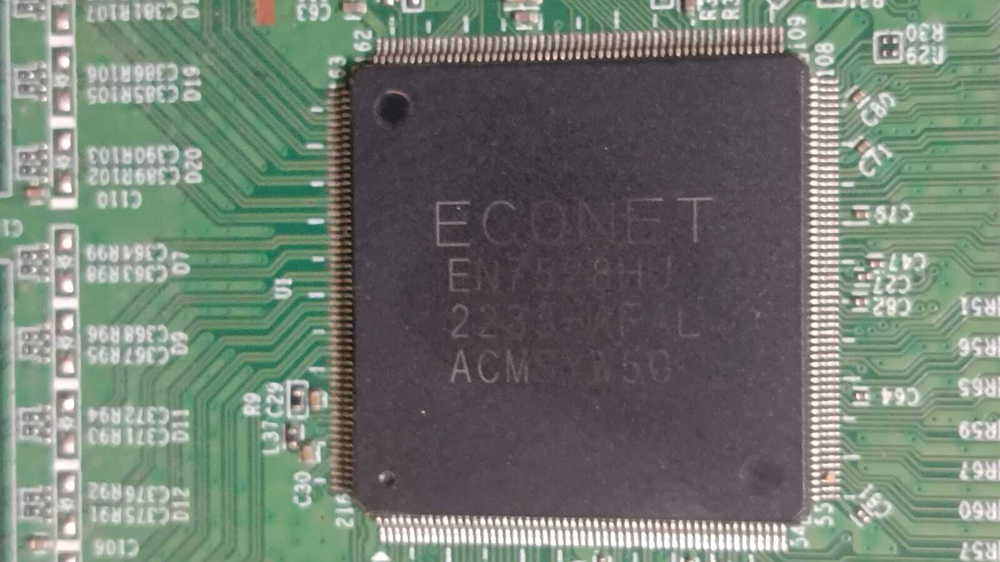
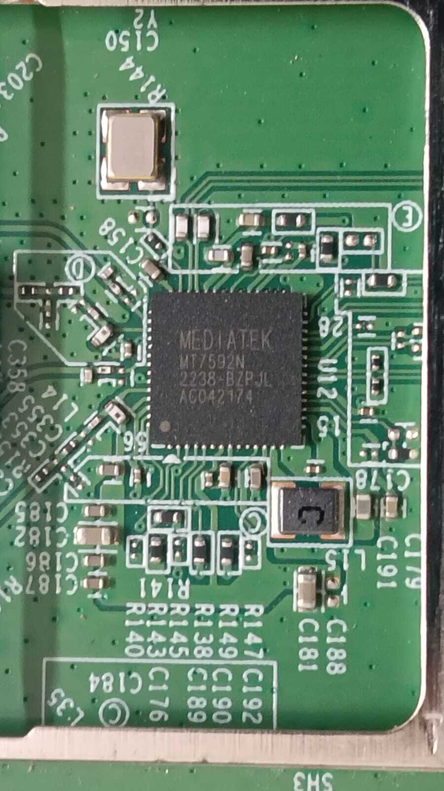
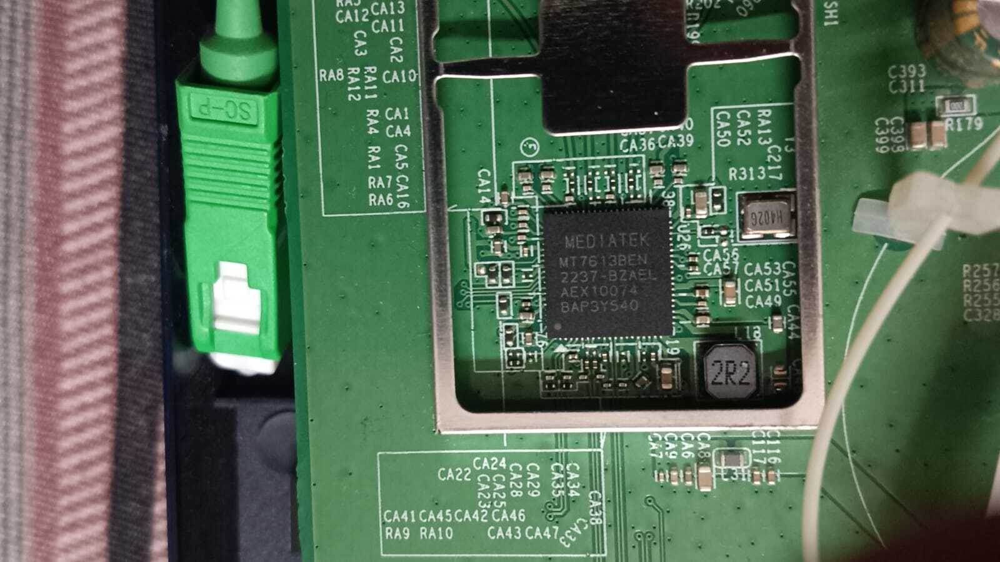
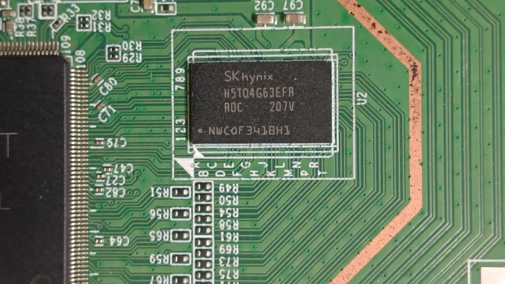
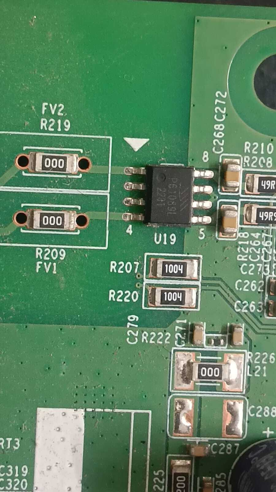

# Hardware Components

All components identified by visual inspection and PCB markings.

## Main SoC — EcoNet EN7528HU



| Field | Value |
|---|---|
| Manufacturer | EcoNet Semiconductor (acquired by MediaTek) |
| Part number | EN7528HU |
| Date code | 2233-AFAL / ACMSYW5G |
| PCB reference | U1 |
| Architecture | MIPS 1004Kc, 4 cores @ 900MHz |
| Internal codename | TC3162 / EN751221 |
| Function | CPU, GPON fiber uplink, Ethernet switching |

Boot log confirmation:
```
EcoNet EN7528 SOC prom init
CPU0 revision is: 0001992f (MIPS 1004Kc)
CPU frequency 900.00 MHz
MIPS: machine is econet,en751221
```

---

## Wi-Fi — MediaTek MT7592N



| Field | Value |
|---|---|
| Manufacturer | MediaTek |
| Part number | MT7592N |
| Date code | 2238-BZPJL / AC042174 |
| PCB reference | U12 |
| Function | Dual-band 802.11n/ac (2.4GHz + 5GHz) |

---

## Wi-Fi — MediaTek MT7613BEN



| Field | Value |
|---|---|
| Manufacturer | MediaTek |
| Part number | MT7613BEN |
| Date code | 2237-BZAEL / AEX10074 / BAP3Y540 |
| Function | 802.11ac + Bluetooth combo, secondary 5GHz radio |

Boot log identifies this as chip ID 0x7663:
```
RTMPInitPCIeDevice():device_id=0x7663
mt_pci_chip_cfg(): HWVer=0x8a10, FWVer=0x8a01, pAd->ChipID=0x7663
```

---

## RAM — SK Hynix H5TQ4G63EFR



| Field | Value |
|---|---|
| Manufacturer | SK Hynix |
| Part number | H5TQ4G63EFR |
| Date code | ADC 207V |
| PCB reference | U2 |
| Capacity | 512MB DDR3 (4Gbit) |
| Lot code | NWC0F3418H1 |

Boot log confirmation:
```
DRAM size=512MB
memsize:432MB   (usable after reserved regions)
```

---

## SPI NOR Flash — Puya P25Q80L



| Field | Value |
|---|---|
| Manufacturer | Puya Semiconductor |
| Part number | P25Q80L |
| PCB reference | U19 |
| Package | SOP-8 |
| Capacity | 8Mbit (1MB) |
| Contents | Bootloader only |
| Programmer | CH341A + SOIC-8 clip |

Pin 4 and pin 5 marked on PCB silkscreen flanking the chip.

Boot log note: The main firmware is stored on the SPI NAND (Micron MT29F2G01), not this chip.

---

## SPI NAND Flash — Micron MT29F2G01

Detected in boot log only — not photographed separately.

| Field | Value |
|---|---|
| Manufacturer | Micron Technology |
| Part number | MT29F2G01 |
| mfr_id | 0x2c |
| dev_id | 0x24 |
| Capacity | 256MB (2Gbit) |
| Contents | Full firmware, config partitions |

Boot log confirmation:
```
nand: Micron _SPI_NAND_DEVICE_ID_MT29F2G01
nand: 256MiB, SLC, page size: 2048, OOB size: 64
```

---

## PCB Details

| Field | Value |
|---|---|
| Board marking | ASKDCB (Sercomm internal code) |
| PCB ID | E239218 |
| Standard | 94V-0 |
| Additional markings | K-3 03-01 / 03900385B |
| Made in | India |
